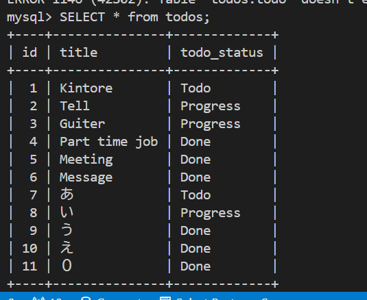

# Todo アプリ

## 使用技術

### フロントエンド

- Next.js
- TailWind CSS

### バックエンド

- MySQL

### 開発環境

- Docker
- Node.js 環境用コンテナ
- MySQL 用コンテナ

## データベース構造

## プロジェクトの概要

タスク管理アプリであり、タスクを 3 つのステータスに分けて整理できます。
以下の機能を実装しています：

- タスクの新規作成
- タスクの更新
- タスクの削除

## ローカル開発サーバーの起動

以下の手順で開発サーバーを起動できます：

1. `docker compose up` を実行し、イメージを取得
2. `docker start node mysql` を実行し、コンテナを起動
3. `docker exec -it node /bin/bash` を実行し、node コンテナに接続
4. node コンテナ内で `app-next` ディレクトリに移動し、`npm run dev` を実行

## 参考資料

[Todo アプリを Next.js+TypeScript+Prisma で作ってみた](https://note.com/rect_angle/n/ne59025be8208)
